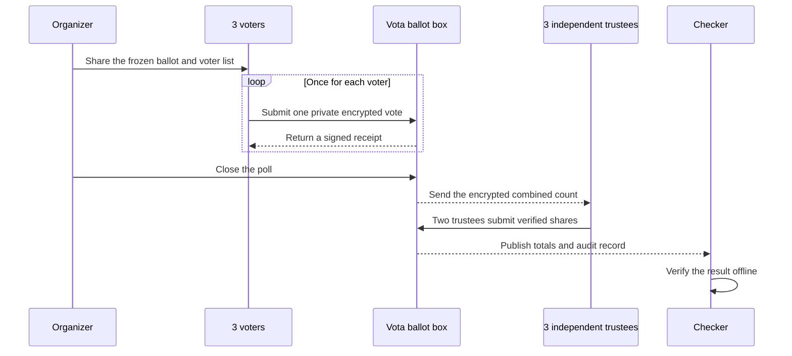

# Vota

Vota is experimental educational software for anonymous, encrypted polls. It
is not suitable for real elections or consequential decisions.

## Example: A Team Lunch Poll

Imagine three colleagues choosing lunch. Each person chooses pizza, ramen, or
salad. The result can say `pizza: 2` and `ramen: 1`, but the published record
does not say which colleague made either choice.

Run the local walkthrough from the repository root:

```sh
./examples/three-dev-anonymous-poll/three-dev-anonymous-poll.sh
```

It creates the poll, asks three people for a private choice, prints the final
totals, and checks that the published record is internally consistent. The
walkthrough deletes its temporary data when it finishes. Set `KEEP_DEMO=1` to
retain it for inspection.



This protects the connection between a ballot and an eligible voter in the
public record. It does not hide who connects to the collector, when they vote,
or what a small result reveals from context. Read the
[security model and limitations](docs/security.md) before relying on it.

The [three-developer walkthrough](examples/three-dev-anonymous-poll/README.md)
explains this same example from a plain-language view through the underlying
cryptography.

## Planned Team Mode

The current workflow favors cryptographic separation between voters, the
collector, and independent trustees. For frequent, low-consequence decisions
inside a remote team, we plan to add a simpler mode: one hosted server, team
login, browser-based poll creation, shareable links, one-click voting, and
automatic results.

Team mode uses a different trust model. The team trusts the hosted service not
to retain or misuse identity-to-vote information. During submission, the server
must temporarily know both facts:

```text
authenticated member: Alice
selected choice: Ramen
```

It needs the member identity to enforce one vote and the selected choice to
increment the correct total. Avoiding IP and timing logs removes retained
metadata, but it cannot make the vote cryptographically private from the
server.

The intended guarantee is:

> After an honest server processes a vote, its normal stored data, logs, API
> responses, and public audit records do not reveal which member selected which
> choice.

| Property                                                | Team-mode guarantee                                             |
| ------------------------------------------------------- | --------------------------------------------------------------- |
| One accepted vote per eligible member                   | Enforced by authentication and a unique participation record    |
| Choice hidden from teammates                            | Yes, except when a small result makes it inferable from context |
| No stored member-to-choice mapping                      | Yes, in normal application storage, logs, and audit output      |
| Privacy from the server during submission               | No                                                              |
| Privacy from an operator with host access               | No                                                              |
| Protection from unanimous or otherwise revealing totals | No                                                              |

HTTPS protects choices from network observers, but not from the server. Hidden
live totals reduce inference before close, but a final result from a small team
can still reveal a choice. Strong privacy from the server would require
anonymous credentials, client-side cryptography, and at least one independent
trustee, which returns to the more involved workflow demonstrated above.

The complete proposed design is captured in the local team-mode PRD. Team mode
is not implemented yet.

## Developer Quick Start

```sh
go build -o /tmp/vota ./cmd/vota
/tmp/vota --help
go test ./test/e2e -run TestAnonymousPollWorkflow -count=1
```

The end-to-end test runs a complete local poll with three trustees and five
eligible identities on Linux and macOS.

Documentation:

- [Getting started](docs/getting-started.md)
- [Security model and limitations](docs/security.md)
- [Cryptographic design review status](docs/design-review.md)
- [Collector operations](docs/operations.md)
- [Experimental protocol](docs/protocol/vota-v1-experimental.md)
- [Public artifacts](docs/protocol/artifacts.md)
- [Dependencies](docs/protocol/dependencies.md)
- [Concept examples](examples/README.md)
