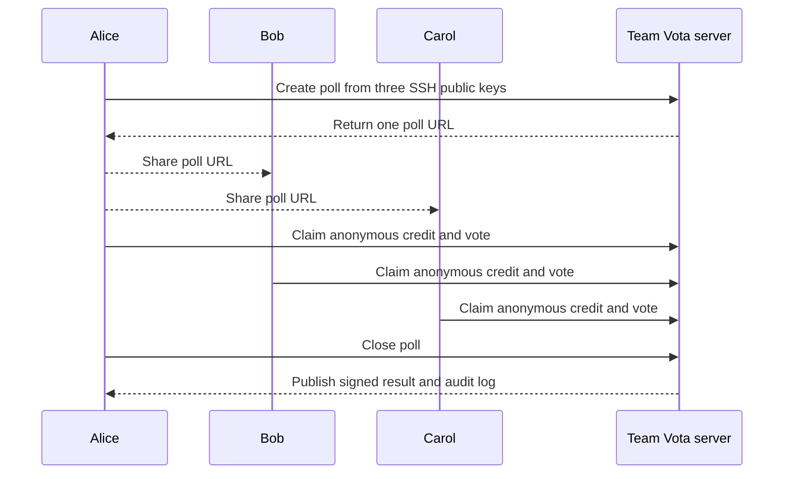
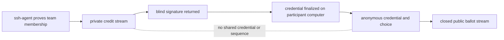
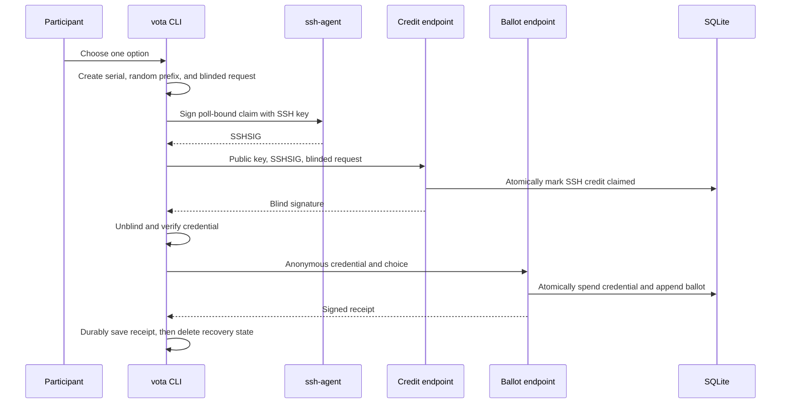
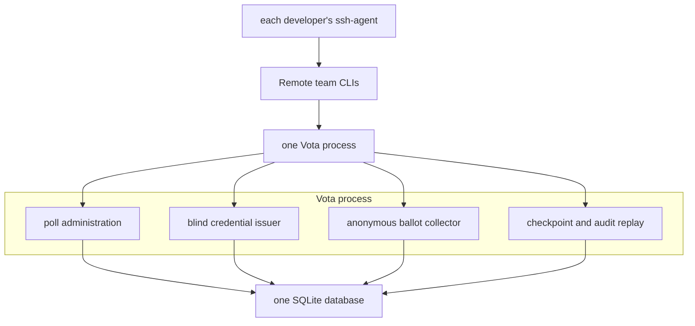

# Vota

Vota helps a small remote team make an anonymous decision from the command
line. One person creates a poll from the team's SSH public keys. Each teammate
gets one vote. The final record shows the choices and totals, but it does not
contain a link between an SSH key and a ballot.

Vota is built for low-consequence team questions such as lunch, meeting times,
or choosing between small technical proposals. It is not suitable for public
elections, employment decisions, compensation, or other consequential votes.

## Example: three developers choose lunch

Alice, Bob, and Carol already use SSH keys for development. Alice creates a
file containing their public keys:

```text
alice ssh-ed25519 AAAAC3NzaC1lZDI1NTE5AAAA...
bob ssh-ed25519 AAAAC3NzaC1lZDI1NTE5AAAA...
carol ssh-ed25519 AAAAC3NzaC1lZDI1NTE5AAAA...
```

Alice creates the poll and shares the returned URL:

```sh
vota poll create \
  --server https://vota.example \
  --admin-identity ~/.ssh/id_ed25519.pub \
  --members team.keys \
  --question "Where should we have lunch?" \
  --choice Pizza \
  --choice Ramen \
  --choice Salad \
  --closes-at 2026-07-12T16:00:00Z
```

Each developer votes from their own computer:

```sh
vota vote https://vota.example/polls/sha256:... \
  --identity ~/.ssh/id_ed25519.pub
```

The command displays numbered choices, asks `ssh-agent` to approve the claim,
and saves a private receipt. No private SSH key is read or uploaded by Vota.

Alice closes the poll. Anyone can read the result:

```sh
vota poll close https://vota.example/polls/sha256:... \
  --admin-identity ~/.ssh/id_ed25519.pub

vota poll result https://vota.example/polls/sha256:...
```

```text
Where should we have lunch?

Pizza: 1
Ramen: 1
Salad: 1
Total votes: 3
```



Run the complete local example in
[`examples/ssh-credit-team`](examples/ssh-credit-team/README.md).

## What the privacy claim means

The server sees an SSH identity while issuing a voting credit. Blind signing
prevents it from learning the credential it signs. Later, the ballot endpoint
sees that anonymous credential and the selected choice, but it receives no SSH
key or SSH signature.

The database keeps those facts in independent streams:



This provides a precise guarantee: normal stored records and the public audit
log cannot cryptographically connect an allowlisted SSH key to a ballot.

It does not provide privacy from a malicious server operator watching live
traffic. An operator can correlate IP addresses, timing, process memory, or
request order. The deployment assumes the server does not perform that
correlation and does not add such logging.

## What moves between computers

No shared folder or manual ceremony is required.

| Item           | Where it starts    | Where it goes                 | Contains                                     |
| -------------- | ------------------ | ----------------------------- | -------------------------------------------- |
| `team.keys`    | Poll administrator | Server during poll creation   | Public SSH keys only                         |
| Poll URL       | Server             | Team chat                     | Public poll identifier                       |
| Credit claim   | Participant CLI    | Credit endpoint               | SSH public key, SSHSIG, blinded request      |
| Blind response | Credit endpoint    | Participant CLI               | Blind RSA signature                          |
| Recovery state | Participant CLI    | Stays on that computer        | Serial, blinding inverse, unfinished request |
| Ballot         | Participant CLI    | Ballot endpoint               | Anonymous credential and choice              |
| Receipt        | Ballot endpoint    | Stays on participant computer | Signed ballot inclusion evidence             |
| Audit log      | Server after close | Anyone                        | Anonymous ballots, tally, checkpoints        |



## Architecture

Deployment needs one Vota process and one SQLite database. The same process
contains the administrator, credit, ballot, and audit paths. Separate packages
and database tables reduce accidental joins; they are not separate services.



## Cryptographic construction

For readers who want the exact construction:

- SSH authorization uses OpenSSH SSHSIG with Ed25519 keys and distinct
  `vota-poll-admin@vota.local` and `vota-credit-claim@vota.local` namespaces.
- Anonymous credentials use the RFC 9474
  `RSABSSA-SHA384-PSS-Randomized` variant. Preparation adds a fresh 32-byte
  prefix. PSS uses SHA-384, MGF1-SHA-384, and a 48-byte salt.
- The credential message binds the protocol domain, poll ID, issuer key ID,
  and a fresh 32-byte serial. The prefix is carried with the final signature.
- A unique SSH fingerprint can receive one blind response per poll. Exact
  retries return the stored response. A changed request is rejected.
- A unique hash of the finalized bearer credential can enter one ballot per
  poll. Claim and redemption uniqueness are enforced in SQLite transactions.
- Credit and ballot events have independent sequences and SHA-256 hash chains.
  Ed25519 checkpoints sign each ballot-chain head. Closing appends a signed,
  immutable tally.
- Offline replay checks event order, previous hashes, event hashes, unique
  credential hashes, choice membership, receipts, checkpoints, and totals.

The implementation includes the official RFC 9474 randomized test vector and
OpenSSH interoperability fixtures.

## Start here

- [Five-minute quickstart](docs/ssh-credit-quickstart.md)
- [Operations and deployment](docs/operations.md)
- [Security model](docs/security.md)
- [Product requirements](docs/prds/002-ssh-credit-sequencer.md)

Development checks:

```sh
go test ./...
go test -race ./internal/crypto/... ./internal/sequencer ./internal/sequencerstore
go vet ./...
```
