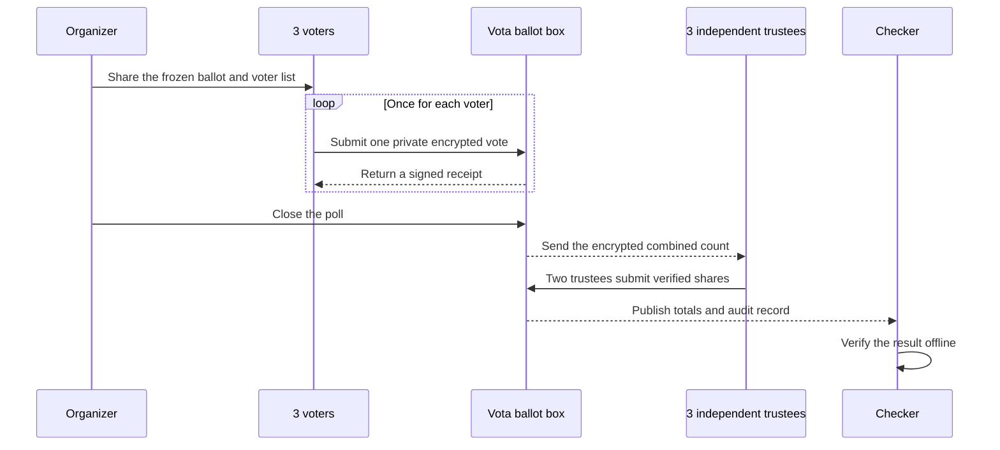

# Vota

Vota is experimental educational software for anonymous, encrypted polls. It
is not suitable for real elections or consequential decisions.

## Example: A Team Lunch Poll

Imagine three colleagues choosing lunch. Each person chooses pizza, ramen, or
salad. The result can say `pizza: 2` and `ramen: 1`, but the published record
does not say which colleague made either choice.

Run the local walkthrough from the repository root:

```sh
./examples/three-dev-anonymous-poll/three-dev-anonymous-poll.sh
```

It creates the poll, asks three people for a private choice, prints the final
totals, and checks that the published record is internally consistent. The
walkthrough deletes its temporary data when it finishes. Set `KEEP_DEMO=1` to
retain it for inspection.



This protects the connection between a ballot and an eligible voter in the
public record. It does not hide who connects to the collector, when they vote,
or what a small result reveals from context. Read the
[security model and limitations](docs/security.md) before relying on it.

The [three-developer walkthrough](examples/three-dev-anonymous-poll/README.md)
explains this same example from a plain-language view through the underlying
cryptography.

## Developer Quick Start

```sh
go build -o /tmp/vota ./cmd/vota
/tmp/vota --help
go test ./test/e2e -run TestAnonymousPollWorkflow -count=1
```

The end-to-end test runs a complete local poll with three trustees and five
eligible identities on Linux and macOS.

Documentation:

- [Getting started](docs/getting-started.md)
- [Security model and limitations](docs/security.md)
- [Cryptographic design review status](docs/design-review.md)
- [Collector operations](docs/operations.md)
- [Experimental protocol](docs/protocol/vota-v1-experimental.md)
- [Public artifacts](docs/protocol/artifacts.md)
- [Dependencies](docs/protocol/dependencies.md)
- [Concept examples](examples/README.md)
