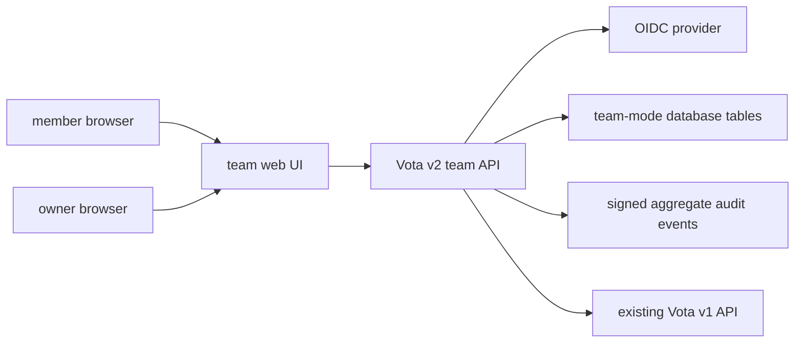
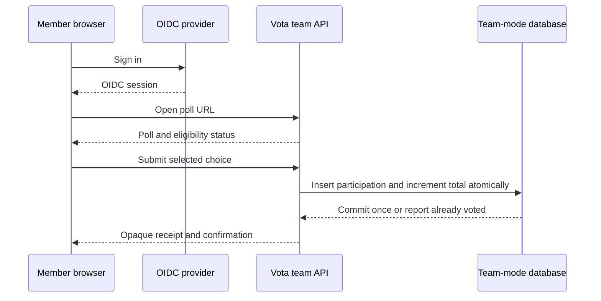
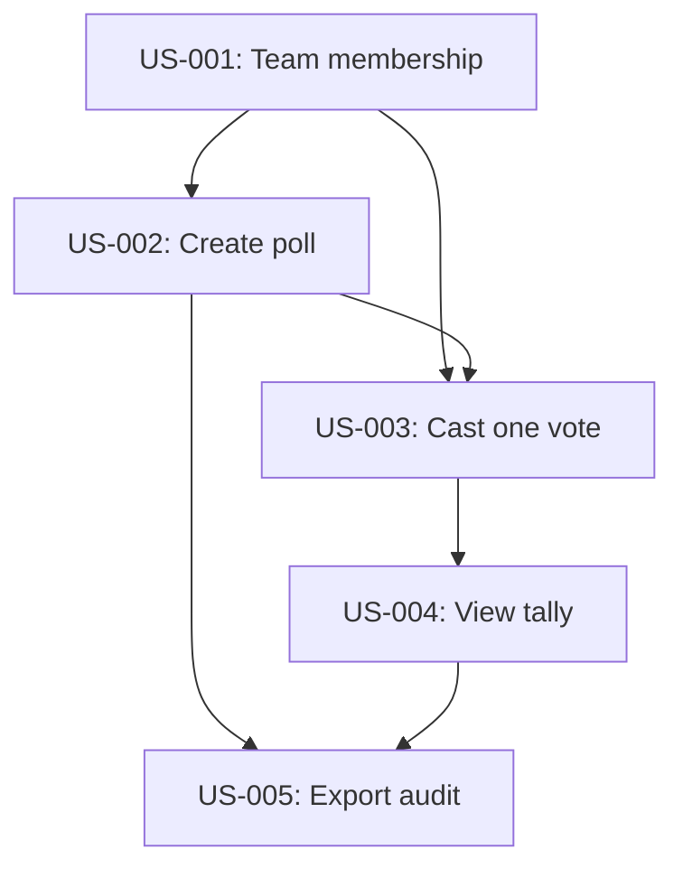
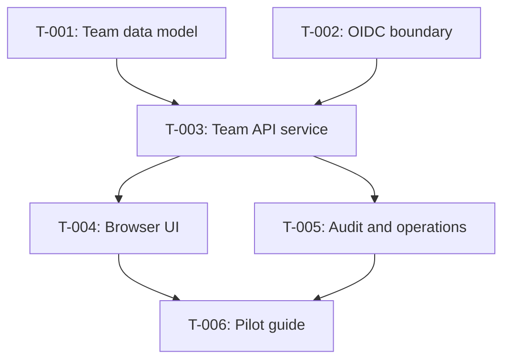

# Team Mode for Recurring Remote Polls

## 1. Purpose

Make Vota useful for a remote team making frequent, low-consequence decisions
without distributing keys, trustee artifacts, or command-line instructions to
every participant. Team mode provides one hosted service, a browser-first
workflow, and a small REST API.

This mode assumes the team trusts the hosted service not to retain or misuse
identity-to-vote information. It protects choices from other team members and
keeps the published record free of a voter-to-choice mapping. It does not
provide cryptographic privacy from the server operator.

## 2. Goals

- Let an owner create a poll with a question, two to ten choices, a close time,
  and eligible team members in under one minute.
- Let an authenticated member vote from a shared URL in two interactions or
  fewer: open poll, choose option, confirm.
- Enforce one accepted vote per member per poll without persisting a member ID
  beside a selected option or publishing that association.
- Hide live totals by default and publish a final tally automatically at the
  close time or when an owner closes the poll.
- Provide browser UI and versioned JSON API surfaces from one deployed Vota
  server.
- Let a member download a receipt and let any team member export a poll audit
  record containing no participant identity or individual choice.
- Keep existing `v1` cryptographic CLI and collector behavior compatible and
  unchanged.

## 3. Non-Goals

- Cryptographic privacy from a malicious server operator or host administrator.
- Anonymous network transport, IP-address concealment, or timing protection.
- Real elections, HR decisions, compensation decisions, or other consequential
  uses.
- Replacing the existing trustee ceremony or making team mode artifacts
  compatible with `vota-v1-experimental` protocol artifacts.
- Supporting arbitrary external voting links, unauthenticated voters, or
  cross-team poll membership in v1.
- Native mobile applications. The web UI must be responsive on mobile browsers.

## 4. Solution Design

Add a separate `team mode` application surface to the existing server. An
operator deploys one Vota instance with HTTPS, database storage, OIDC login,
and an initial team-owner bootstrap configuration. Team owners manage members
through the configured identity provider or a server-managed allowlist.

An owner creates a poll in the browser or through `v2` API. The service records
the eligible member IDs at creation time. A member opens the poll URL, signs in,
selects a choice, and receives a receipt. The service transaction first records
that the member participated, then increments only the selected choice total.
The vote-total record contains no member ID. A signed audit event records the
poll state and aggregate count, never the member ID or selected option.

After the closing time, the service rejects new votes and publishes totals. A
poll owner can close early. Live totals remain hidden until close by default;
owners may explicitly enable live totals for low-stakes polls. The browser
explains the trust model before a first vote and links to the existing
experimental-use warning.

Release in this order:

1. Add data model, OIDC session boundary, and team-mode REST API behind an
   explicit server configuration flag.
1. Add the browser member and owner flows.
1. Add audit export, logging controls, metrics, operational documentation, and
   a small-team deployment guide.
1. Run a limited internal team pilot. Keep team mode disabled by default until
   the pilot completes.

## 5. Target Architecture

`v1` remains the educational cryptographic collector. Team mode is a separate
`v2` API and storage model in the same server process. It must not reuse the
v1 ballot, trustee-share, or audit schemas because its trust model is different.



The browser contains no long-lived Vota private key in team mode. OIDC session
identity authorizes membership. The API maps an authenticated subject to a team
member ID, evaluates eligibility, and makes one atomic transaction that:

1. inserts the participation marker for `(poll_id, member_id)`;
1. increments the chosen aggregate counter;
1. writes a receipt record keyed by an opaque receipt ID;
1. appends an aggregate-safe audit event.

The database uses a unique constraint on `(poll_id, member_id)` so concurrent
browser requests cannot produce two accepted votes. The vote-total table has no
member identifier. Requests are served only over HTTPS in production.



## 6. Invariants

- Team mode is disabled unless explicitly enabled in server configuration.
- An authenticated member can have at most one accepted participation marker
  per poll.
- A vote transaction either records both participation and one aggregate count,
  or records neither.
- No persisted team-mode vote-total row, receipt, audit event, API response, or
  application log contains both a member identifier and a selected choice.
- A poll stores its eligible member snapshot at creation time. Later membership
  changes do not change eligibility for that poll.
- New votes are rejected after close. Closing is idempotent and preserves the
  first final tally.
- Hidden-total polls do not return partial counts to members, owners, or API
  callers before close.
- Every receipt maps to one accepted participation event and final tallies equal
  the count of accepted participation markers.
- Team-mode endpoints never accept or emit v1 cryptographic artifacts.
- Existing `v1` endpoint paths, schemas, CLI output, and tests remain stable.

## 7. Observability

- Log only route template, response status, duration, request ID, and
  team-mode error code. Do not log OIDC subject, team ID, poll ID, option ID,
  receipt ID, request body, authorization header, or raw URL query.
- Expose counters for poll creation, vote attempts, accepted votes,
  duplicate-vote rejections, poll closures, OIDC failures, and audit exports.
- Expose a gauge for open polls and a histogram for vote transaction duration.
- Add a protected operator endpoint showing configuration readiness, OIDC
  readiness, database readiness, and aggregate metrics only.
- Alert on repeated authentication failures, database transaction failures, and
  a mismatch between accepted participation count and final tally count.
- Include redaction tests that exercise error paths and HTTP request logging.

## 8. APIs

All endpoints below require an authenticated OIDC session unless stated
otherwise. API responses use canonical JSON. The API prefix is `/v2` to keep
the existing `/v1` protocol surface intact.

| Method and path                  | Role            | Behavior                                      |
| -------------------------------- | --------------- | --------------------------------------------- |
| `POST /v2/teams/{team_id}/polls` | owner           | create a draft or open poll                   |
| `GET /v2/teams/{team_id}/polls`  | member          | list visible polls without partial totals     |
| `GET /v2/polls/{poll_id}`        | eligible member | return poll details and caller vote status    |
| `POST /v2/polls/{poll_id}/votes` | eligible member | accept one selected choice and return receipt |
| `POST /v2/polls/{poll_id}/close` | owner           | close early and return final tally            |
| `GET /v2/polls/{poll_id}/tally`  | eligible member | return final tally after close                |
| `GET /v2/polls/{poll_id}/audit`  | eligible member | return aggregate-safe audit record            |

Create request:

```json
{
  "question": "Where should we have lunch?",
  "choices": ["Pizza", "Ramen", "Salad"],
  "closes_at": "2026-07-12T16:00:00Z",
  "show_live_totals": false
}
```

Vote request and response:

```json
{"choice_id":"ramen"}
```

```json
{
  "receipt_id": "tmr_01J...",
  "accepted_at": "2026-07-12T15:04:05Z",
  "poll_state": "open"
}
```

Duplicate submissions return `409` with `code: "already_voted"`. A vote for
an unavailable choice returns `422` with `code: "invalid_choice"`. An
ineligible or unauthenticated caller receives `403` or `401` without revealing
the membership roster.

## 9. Security

Team mode is a server-trusted convenience feature. The server can associate an
authenticated request with a member in memory and can inspect database access.
It must be operated under a written minimal-logging and access-control policy.

- Require HTTPS, secure HttpOnly SameSite session cookies, OIDC issuer and
  audience validation, CSRF protection for browser mutations, and rate limits.
- Require owner role for membership-sensitive actions, poll creation, early
  close, and live-total configuration.
- Store only an opaque normalized OIDC subject identifier for membership and
  participation. Encrypt database backups and restrict database access.
- Prevent request logging middleware, tracing, panic reports, analytics,
  reverse proxies, and error reporters from retaining identity-plus-choice data.
- Use generic authorization errors that do not disclose whether another member
  has voted or who is eligible.
- State in UI and API documentation that the service can observe identity,
  network metadata, and vote submission timing. Do not describe this mode as
  anonymous from the server.
- Keep v1's experimental warning and do not market team mode for consequential
  decisions.

## 10. UX

The default member page shows the question, choices, close time in the member's
time zone, the number of eligible members, the privacy statement, and one
primary vote action. It does not show other voters or live totals unless the
owner enabled them. Confirmation replaces the choices with `Vote recorded` and
an option to download the receipt.

The owner page shows open and closed polls, participation count but not a list
of voters, close time, share link, and final tally after close. Creation has a
single form with inline validation: question required, two to ten unique
choices, close time required and in the future.

The browser UI must support keyboard-only voting, visible focus, color-safe
choice selection, screen-reader labels, timezone clarity, and narrow screens.
It must have explicit loading, expired-poll, already-voted, unauthorized, and
network-retry states.

## 11. User Stories

**Dependency Graph:**



### US-001: Join a configured team

**Description:** As a team member, I want to sign in with the configured
identity provider so that Vota can show polls for my team.

**Context:** Team mode removes manual identity-file distribution while retaining
an explicit and stable eligibility boundary.

**Outcome:** A valid OIDC identity maps to one team membership or receives a
generic access-denied response.

**Scope:** OIDC login, session management, owner bootstrap, and member lookup.

**Out of Scope:** Self-service team creation and cross-team membership.

**Dependencies:** None.

**Acceptance Criteria:**

- [ ] A configured team member can sign in and list team polls.
- [ ] A valid identity outside the team receives `403` without team roster data.
- [ ] Logout invalidates the browser session and subsequent API calls return
  `401`.

**Verification:**

- [ ] Integration tests use a local OIDC test issuer for member and non-member
  cases.

### US-002: Create a short team poll

**Description:** As a team owner, I want to create and share a poll so that my
remote team can decide quickly.

**Context:** The current workflow requires a key ceremony and per-voter
enrollment before every poll.

**Outcome:** An owner receives a share URL for an open poll with an immutable
eligibility snapshot.

**Scope:** Owner form and API, option validation, eligibility snapshot, and
scheduled closing metadata.

**Out of Scope:** Editing a poll after it is opened.

**Dependencies:** US-001.

**Acceptance Criteria:**

- [ ] A poll with two to ten distinct choices and a future close time returns
  `201` and a share URL.
- [ ] The poll stores all currently eligible member IDs in its snapshot.
- [ ] Non-owners receive `403` from the creation endpoint.

**Verification:**

- [ ] API and browser tests cover valid creation, duplicate choices, expired
  close time, and owner authorization.

### US-003: Cast one private team vote

**Description:** As an eligible member, I want to choose one option once so
that my input counts without being exposed to teammates.

**Context:** The server is trusted for this mode, but neither the public audit
record nor normal product storage should retain identity beside choice.

**Outcome:** The member receives an opaque receipt and repeated submissions are
rejected without changing totals.

**Scope:** Vote form, atomic participation and tally transaction, receipt, and
duplicate handling.

**Out of Scope:** Server-blind encryption and anonymous transport.

**Dependencies:** US-001, US-002.

**Acceptance Criteria:**

- [ ] An eligible member can submit one listed choice and receives `201` with
  an opaque receipt ID.
- [ ] A second submission by that member returns `409 already_voted` and does
  not change any total.
- [ ] Concurrent submissions from two browser sessions produce exactly one
  accepted vote for the same member.
- [ ] Persisted vote-total rows and audit events contain no member ID.

**Verification:**

- [ ] Transaction-race tests, repository inspection tests, and browser flow
  tests pass.

### US-004: See results only when allowed

**Description:** As a team member, I want to see final totals after close so
that I can act on the decision without learning individual votes.

**Context:** Small teams need a default that limits accidental disclosure from
live, changing counts.

**Outcome:** Hidden-total polls expose only final signed totals after close.

**Scope:** Close scheduler, owner early close, tally endpoint, and results UI.

**Out of Scope:** Differential privacy and preventing inference from unanimous
or small final results.

**Dependencies:** US-003.

**Acceptance Criteria:**

- [ ] `GET /v2/polls/{poll_id}/tally` returns `404 tally_unavailable` before
  close when live totals are disabled.
- [ ] After close, totals sum to the accepted participation count.
- [ ] Closing twice preserves the first final tally.

**Verification:**

- [ ] Time-controlled service tests cover scheduled and owner-initiated close.

### US-005: Verify aggregate-safe history

**Description:** As a team member, I want to export a poll audit record so that
I can check the published result without accessing server internals.

**Context:** Team mode trades cryptographic ballot anonymity for usability but
must still make final totals and state changes inspectable.

**Outcome:** The export verifies state transitions and aggregate counts without
revealing member identities or individual choices.

**Scope:** Audit schema, export endpoint, offline verifier, and user download.

**Out of Scope:** Reusing the v1 audit bundle format.

**Dependencies:** US-002, US-004.

**Acceptance Criteria:**

- [ ] Export includes poll metadata, eligibility count, aggregate counts,
  state-transition events, and final tally when available.
- [ ] Export includes no OIDC subject, member ID, IP address, receipt ID, or
  selected choice per participant.
- [ ] Offline verification rejects a changed tally or non-monotonic vote count.

**Verification:**

- [ ] Deterministic audit fixtures and tamper tests pass.

## 12. Implementation Tasks

**Dependency Graph:**



### T-001: Add team-mode storage and transactions

**Depends on:** None

**Parallel group:** storage

**Write scope:** migrations/, internal/teamstore/, internal/teamservice/

**Read scope:** internal/store/, internal/app/

**Handoff context:** add isolated team-mode tables and atomic vote transaction;
do not change v1 tables or API behavior

**Acceptance Criteria:**

- [ ] Migration creates team, membership, poll, eligibility snapshot,
  participation, aggregate tally, receipt, and audit-event tables.
- [ ] A uniqueness constraint prevents duplicate `(poll_id, member_id)`
  participation records under concurrent writes.
- [ ] Tests prove vote totals do not store a member ID.

### T-002: Add OIDC authentication and membership boundary

**Depends on:** None

**Parallel group:** auth

**Write scope:** internal/teamauth/, internal/cli/server/, internal/httpapi/

**Read scope:** internal/cli/server/server.go, docs/operations.md

**Handoff context:** expose authenticated principal and owner/member role only
to v2 routes; leave existing bearer-token v1 routes unchanged

**Acceptance Criteria:**

- [ ] Server validates configured OIDC issuer, audience, and callback state.
- [ ] Session cookies are Secure, HttpOnly, and SameSite.
- [ ] Tests reject invalid issuer, expired token, and non-member principal.

### T-003: Build v2 team poll API

**Depends on:** T-001, T-002

**Parallel group:** service

**Write scope:** internal/teamservice/, internal/httpapi/, internal/httpclient/

**Read scope:** internal/app/, internal/protocol/, internal/httpapi/api.go

**Handoff context:** implement only `/v2` endpoints and canonical request
schemas; preserve all `/v1` routes and error codes

**Acceptance Criteria:**

- [ ] Create, list, get, submit vote, close, tally, and audit endpoints match
  the API contract in this PRD.
- [ ] Hidden-total polls return no partial count before close.
- [ ] Duplicate vote requests return `409 already_voted` without changing
  totals.

### T-004: Deliver browser owner and member flows

**Depends on:** T-003

**Parallel group:** web

**Write scope:** web/, internal/cli/server/

**Read scope:** internal/httpapi/, docs/prds/001-team-mode.md

**Handoff context:** provide a responsive web client served by the Vota binary;
avoid introducing a separate deployment requirement

**Acceptance Criteria:**

- [ ] Owner can create a valid poll and copy a share URL.
- [ ] Member can vote with keyboard only and download a receipt.
- [ ] UI shows explicit already-voted, expired-poll, unauthenticated, and
  network-retry states.

### T-005: Add audit, redaction, and operations controls

**Depends on:** T-003

**Parallel group:** operations

**Write scope:** internal/teamaudit/, internal/httpapi/, docs/operations.md,
docs/security.md

**Read scope:** internal/audit/, internal/auditverify/, internal/httpapi/api.go

**Handoff context:** create team-mode-specific aggregate audit verification and
test logging redaction on successful and failed requests

**Acceptance Criteria:**

- [ ] Offline verifier rejects tampered totals and state-event order.
- [ ] Audit export contains no prohibited identity, receipt, or per-voter choice
  fields.
- [ ] Structured logs omit authenticated subject, poll ID, option ID, and
  request body.

### T-006: Publish pilot deployment guide

**Depends on:** T-004, T-005

**Parallel group:** release

**Write scope:** docs/team-mode-pilot.md, README.md

**Read scope:** docs/operations.md, docs/security.md,
docs/prds/001-team-mode.md

**Handoff context:** document one-server HTTPS deployment, OIDC setup,
backup/restore, privacy boundary, and pilot exit criteria

**Acceptance Criteria:**

- [ ] Guide lets an operator configure one HTTPS server and a test OIDC issuer.
- [ ] Guide clearly states server-trusted privacy limits and experimental-use
  restriction.
- [ ] Pilot checklist covers create, vote, duplicate rejection, close, audit,
  restart, and log-redaction verification.

## 13. Open Questions

- Which OIDC provider must the initial pilot support: Google Workspace, GitHub,
  Okta, or a generic standards-compliant issuer?
- Is a server-managed member allowlist sufficient for v1, or must owners invite
  members through the browser?
- What retention period applies to participation markers, receipts, aggregate
  audit events, backups, and access logs?
- Should owners see only an aggregate participation count, or no participation
  information until close?
- Does the team need recurring poll templates, Slack notifications, or calendar
  integration after the initial pilot?

## 14. Progress Tracking

- 2026-07-12: created PRD with server-trusted privacy model based on the team
  requirement for one hosted service and recurring remote decisions
