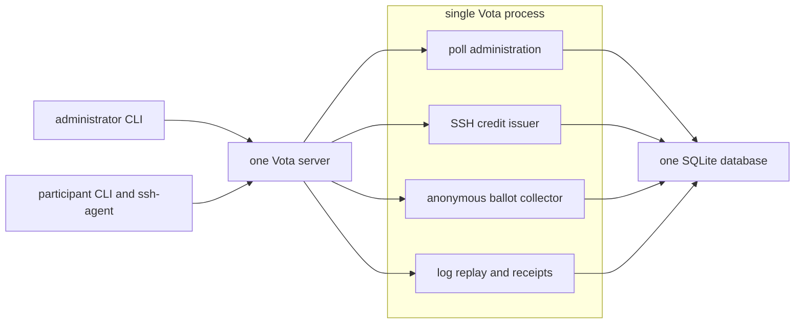
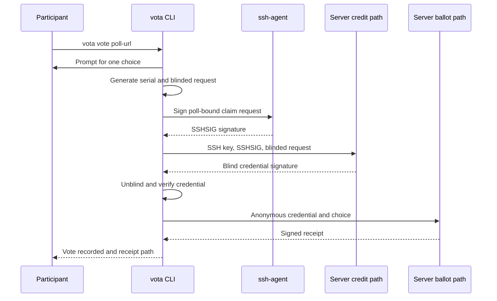
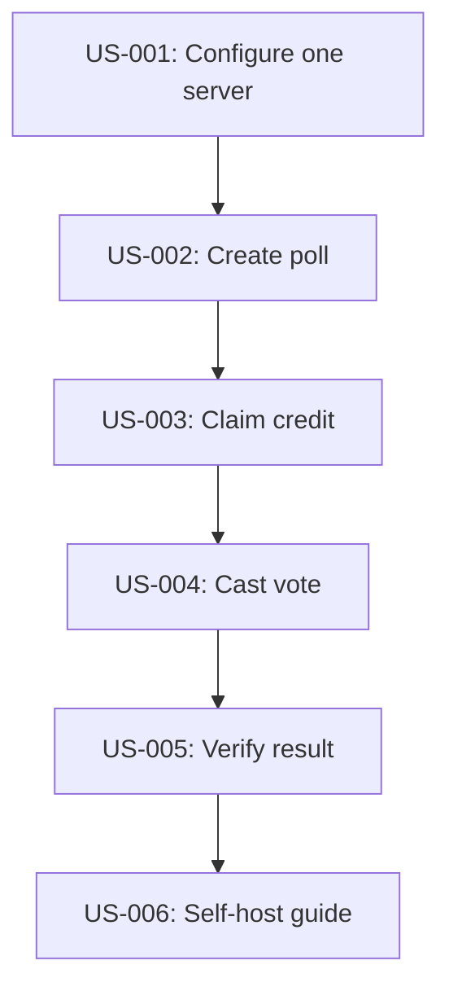
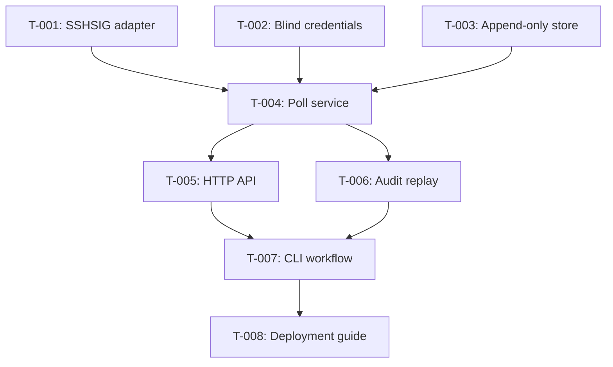

# SSH-Credited Anonymous Poll Sequencer

## 1. Purpose

Let small developer teams run frequent anonymous polls from one Vota server
without browsers, OIDC, cookies, trustee ceremonies, or per-poll key exchange.
Administrators credit existing team SSH public keys when creating a poll.
Participants use the corresponding key through `ssh-agent` to obtain one blind,
anonymous voting credential and submit one vote through a single CLI command.

This feature is intended for low-consequence team decisions and for other teams
to self-host with one binary and one SQLite database. The server is trusted not
to correlate IP addresses, request timing, or live process activity. Persisted
issuer records, ballot records, receipts, and public logs must contain no
cryptographic join from an SSH identity to a selected choice.

## 2. Goals

- Deploy the complete system as one `vota serve` process with one database and
  no external identity provider or application service.
- Let an administrator create a poll from a text file of SSH public keys with
  one command.
- Let an eligible participant vote with one command and an existing SSH
  Ed25519 key loaded in `ssh-agent`.
- Give each allowlisted SSH key exactly one claimable voting credit per poll.
- Convert an SSH-authorized credit into a poll-bound blind credential that the
  ballot path cannot link cryptographically to the SSH key.
- Reject duplicate credential issuance and duplicate credential redemption
  atomically under concurrent requests.
- Build poll state, receipts, tally, and offline verification on signed,
  append-only hash-chained logs.
- Hide anonymous ballots and partial totals until poll close by default.
- Replace the existing trustee and encrypted-election workflow with this
  SSH-credit sequencer as Vota's only supported architecture.
- Document a copy-paste deployment path suitable for another small developer
  team.

## 3. Non-Goals

- Privacy from a malicious operator observing both issuance and redemption in
  real time on the shared host.
- Hiding IP addresses, request timing, TLS fingerprints, or traffic volume.
- Browser UI, OIDC, cookies, accounts, email invitations, or mobile apps.
- Separate issuer, collector, database, or trustee deployments.
- Threshold decryption, encrypted choices, or cryptographic secrecy of a choice
  from the ballot collector.
- Supporting RSA, ECDSA, DSA, SSH certificates, or FIDO-backed SSH keys in the
  first implementation. Version 1 accepts `ssh-ed25519` public keys only.
- Safe credential recovery on another computer after issuance.
- Real elections or consequential organizational decisions.

## 4. Solution Design

The operator configures one Vota server with an owner-only sequencer signing
key, an owner-only blind-credential issuer key, and a text file containing SSH
public keys authorized to create polls. The server creates both private keys on
first startup when absent.

A poll administrator prepares an age-inspired recipient file containing one
participant name and `ssh-ed25519` public key per line. `vota poll create`
canonicalizes the question, choices, closing time, and allowlist; asks
`ssh-agent` to sign that request under the `vota-poll-admin@vota.local`
namespace; and sends it to the sequencer. The server verifies the administrator
key, snapshots the eligible SSH keys, creates one credit per fingerprint, and
appends `poll_created` to the public log.

`vota vote` hides two protocol operations behind one command:

1. The CLI generates and persists a random credential serial plus blind-signing
   state. It asks `ssh-agent` to sign the poll ID and blinded request under the
   `vota-credit-claim@vota.local` namespace. The sequencer verifies the key is
   credited and has not claimed, blind-signs the request, and appends a claim to
   the private credit log.
1. The CLI unblinds and verifies the credential, then submits the credential
   and selected choice without the SSH key or signature. The sequencer verifies
   the poll-bound credential, atomically rejects a spent serial, appends the
   anonymous ballot to the private ballot log, and returns a signed receipt.

The server maintains two independent append-only streams in the same SQLite
database:

- A private credit stream containing SSH fingerprints and blinded issuance
  transcripts. It is never exported and shares no event sequence, request ID,
  or fine-grained timestamp with ballot events.
- A ballot stream containing anonymous credentials, credential hashes,
  choices, poll state, and sequencer signatures. Open-poll ballot events remain
  private. Closing a poll freezes and publishes the complete ballot stream and
  tally for offline verification.

The append-only logs simplify state reconstruction and audit but are not the
anonymity mechanism. Blindness separates SSH credit claims from ballot
credentials. The single-server no-metadata-correlation assumption remains
explicit.

Rollout order:

1. Add SSHSIG verification, blind credentials, and deterministic vectors.
1. Add append-only storage and poll service state transitions.
1. Add HTTP endpoints and the four-command CLI workflow.
1. Add receipt and audit replay, packaging, and a one-server deployment guide.

## 5. Target Architecture

All components run in one process. Package boundaries prevent accidental data
joins and keep protocol responsibilities independently testable.



The administrator and participant experiences are file and command oriented:

```text
team.keys            public SSH keys, one per line
poll.json            downloaded signed poll artifact
receipt.json         private anonymous receipt
audit/               published closed-poll record
```

One vote follows this sequence:



The SQLite schema uses separate tables and independent chains:

```text
polls
poll_choices
poll_credits
credit_events
ballot_events
spent_credentials
poll_tallies
sequencer_checkpoints
```

`poll_credits` and `credit_events` may contain SSH fingerprints but never
credential serials or choices. `ballot_events` may contain anonymous
credentials, hashes, and choices. `spent_credentials` contains credential
hashes. Neither contains SSH keys or fingerprints.

## 6. Invariants

- One server process and one SQLite database are sufficient for all supported
  workflows.
- Each poll snapshots two or more unique canonical `ssh-ed25519` public keys at
  creation. Later changes to `team.keys` do not alter the poll.
- Each `(poll_id, ssh_fingerprint)` can produce at most one blind signature.
- Each `(poll_id, credential_hash)` can produce at most one accepted ballot.
- Issuance is idempotent only for the exact persisted request ID and blinded
  message. A different blinded message is rejected after credit claim.
- Ballot acceptance either appends one ballot event and spends one credential,
  or changes neither state.
- Credential messages bind the protocol domain, poll ID, issuer key ID, and a
  32-byte random serial.
- The issuer public key is fixed in the signed poll artifact before any credit
  claim and is identical for every participant.
- Credit events and ballot events use independent sequences, hash chains, and
  timestamps with no cross-stream identifier.
- No ballot event, receipt, tally, public ballot response, public log, or
  application log contains an SSH public key or fingerprint.
- No credit event contains an unblinded credential serial, credential hash, or
  selected choice.
- Open polls do not expose individual anonymous ballots or partial totals.
- Closing is idempotent. The first successful close fixes the ballot set and
  tally permanently.
- Final totals equal the number of accepted ballot events and contain one total
  for every poll choice.
- Legacy trustee, ring-signature, encrypted-ballot, and `/v1` artifacts and
  commands are intentionally unsupported after this replacement.

## 7. Observability

- Log route template, status, duration bucket, random local request ID, and
  stable error code only.
- Do not log IP address, raw URL, poll ID, SSH key, fingerprint, signature,
  issuance request ID, blinded message, credential, choice, receipt ID, request
  body, or authorization material.
- Do not propagate request or trace IDs between credit and ballot handlers.
- Expose aggregate counters for polls created, claim attempts, claims accepted,
  votes attempted, votes accepted, duplicate claims, duplicate redemptions,
  closes, and audit exports.
- Expose gauges for open polls and log-replay health without poll labels.
- At startup and readiness checks, replay both streams and fail readiness on a
  broken sequence, hash chain, signature, projection, or uniqueness invariant.
- Add an operator-only `vota diagnose` command that reports aggregate health and
  counts without identifiers.
- Test server, reverse-proxy example, and panic/error paths for prohibited-field
  leakage.

## 8. APIs

### CLI

The primary workflow has four commands:

```sh
vota serve --config server.json

vota poll create \
  --server https://vota.example \
  --admin-identity ~/.ssh/id_ed25519.pub \
  --members team.keys \
  --question "Where should we have lunch?" \
  --choice Pizza --choice Ramen --choice Salad \
  --closes-at 2026-07-12T16:00:00Z

vota vote https://vota.example/polls/poll-id \
  --identity ~/.ssh/id_ed25519.pub

vota poll result https://vota.example/polls/poll-id
```

`vota vote` prompts for the choice when it is not supplied through
`--choice-stdin`. It never accepts a choice value as a command-line flag. The
identity path names a public key; the private key must be available through
`SSH_AUTH_SOCK`.

Optional audit commands:

```sh
vota audit export --poll poll-id --server https://vota.example --out audit
vota audit verify --record audit
```

### Member allowlist

`team.keys` uses a minimal allowed-signers-inspired format:

```text
alice ssh-ed25519 AAAAC3NzaC1lZDI1NTE5AAAA...
bob ssh-ed25519 AAAAC3NzaC1lZDI1NTE5AAAA...
carol ssh-ed25519 AAAAC3NzaC1lZDI1NTE5AAAA...
```

Names are display-only in the administrator's local file and are excluded from
the signed poll artifact. The server snapshots canonical public keys and
fingerprints in the private credit table. The public poll contains only their
count and a SHA-256 commitment to the sorted canonical keys.

### HTTP

| Method and path                        | Purpose                                               |
| -------------------------------------- | ----------------------------------------------------- |
| `POST /v2/polls`                       | create a signed poll from an SSH-admin-signed request |
| `GET /v2/polls/{poll_id}`              | download signed public poll metadata                  |
| `POST /v2/polls/{poll_id}/credentials` | claim one blind credential with SSHSIG authorization  |
| `POST /v2/polls/{poll_id}/ballots`     | spend one anonymous credential and submit one choice  |
| `POST /v2/polls/{poll_id}/close`       | close with SSH-admin authorization                    |
| `GET /v2/polls/{poll_id}/result`       | fetch final tally or unavailable status               |
| `GET /v2/polls/{poll_id}/audit`        | download closed public ballot stream                  |

Credential claim request:

```json
{
  "ssh_public_key": "ssh-ed25519 AAAA...",
  "issuance_request_id": "base64url-128-bit-value",
  "blinded_message": "base64url-fixed-length-value",
  "sshsig": "base64url-encoded-sshsig"
}
```

The SSHSIG namespace is `vota-credit-claim@vota.local`. Its signed canonical
message binds `poll_id`, `issuance_request_id`, and `SHA-256(blinded_message)`.

Ballot request:

```json
{
  "credential": {
    "issuer_key_id": "issuer-1",
    "serial": "base64url-32-byte-value",
    "signature": "base64url-rsabssa-signature"
  },
  "choice_id": "ramen"
}
```

Errors use stable codes including `not_eligible`, `credit_already_claimed`,
`issuance_request_mismatch`, `invalid_ssh_signature`, `invalid_credential`,
`credential_already_spent`, `invalid_choice`, `poll_not_open`, and
`result_unavailable`.

### Server configuration

```json
{
  "listen_address": "127.0.0.1:8080",
  "database_path": "./vota.sqlite",
  "checkpoint_key_path": "./checkpoint.key",
  "issuer_key_path": "./issuer.key",
  "admin_keys_path": "./admin.keys",
  "public_base_url": "https://vota.example"
}
```

The existing TLS settings remain available. Production documentation recommends
a single reverse proxy or direct Vota TLS, not a multi-service topology.

## 9. Security

The SSH signature authenticates credit claims but is never attached to a
ballot. The CLI uses SSHSIG with application-specific namespaces to prevent
cross-protocol signature reuse. Private SSH keys stay in `ssh-agent`; Vota
reads only public key files and requests signatures through `SSH_AUTH_SOCK`.

The blind credential uses RSABSSA with randomized preparation and deterministic
test vectors based on RFC 9474. The server uses one issuer key ID committed by
the poll artifact. Credential messages use strict canonical encoding and domain
separation. Issuer keys and sequencer checkpoint keys are distinct owner-only
files.

The system protects against:

- an unallowlisted key claiming a credit;
- one allowlisted key claiming two credentials;
- one credential voting twice;
- a credential being replayed in another poll;
- persisted database or audit joins from SSH key to ballot;
- post-close ballot insertion or tally mutation;
- undetected public-log modification under the sequencer signing key.

The system does not protect against:

- a malicious shared host correlating issuance and redemption metadata;
- a malicious issuer minting additional anonymous credentials;
- a malicious sequencer censoring a claim or ballot before issuing a receipt;
- a compromised participant computer or SSH agent;
- theft of an unspent bearer credential;
- inference from small, unanimous, or predictable results;
- host compromise exposing issuer or checkpoint private keys.

The product statement is:

> Vota uses SSH-authorized blind voting credits so its normal stored records and
> public log cannot connect an allowlisted SSH key to an anonymous ballot. This
> assumes the single server does not correlate network metadata or act
> maliciously during issuance and voting.

## 10. UX

Vota is CLI-first and age-inspired: explicit public keys, no account setup, no
configuration discovery, composable files, canonical JSON artifacts, and clear
stdin/stdout behavior.

Administrator flow:

1. Put SSH public keys in `team.keys`.
1. Run `vota poll create` and approve the SSH-agent signature prompt.
1. Share the returned poll URL in team chat.
1. Run `vota poll result` after close or close early with `vota poll close`.

Participant flow:

1. Run `vota vote <poll-url> --identity ~/.ssh/id_ed25519.pub`.
1. Select one numbered choice.
1. Approve the SSH-agent signature prompt.
1. Receive `Vote recorded` and a local receipt path.

The CLI automatically resumes an interrupted issuance from the XDG state
directory using the original request and blinding state. If the credential was
claimed on another computer, it prints:

```text
credit already claimed for this SSH key on this poll
finish voting from the computer that claimed it
```

The CLI must distinguish missing agent, missing key in agent, unsupported key
type, ineligible key, closed poll, lost local recovery state, duplicate vote,
and network retry errors. Secret values never appear in command arguments,
stdout, stderr, shell history, or logs.

## 11. User Stories

**Dependency Graph:**



### US-001: Configure one server

**Description:** As an operator, I want one Vota process and SQLite database so
that my team can self-host without operating an identity or trustee system.

**Context:** The existing workflow requires several role-specific keys and
artifact exchanges for every poll.

**Outcome:** One configuration starts a ready sequencer with persistent signing
and issuer identities.

**Scope:** Server configuration, key creation, database initialization,
readiness, and graceful restart.

**Out of Scope:** High availability and multiple server replicas.

**Dependencies:** None.

**Acceptance Criteria:**

- [x] Starting with valid paths creates missing issuer and checkpoint keys with
  mode `0600` and opens one SQLite database.
- [x] Restarting with the same files preserves server identity and all poll
  state.
- [x] A non-loopback listener requires TLS or the existing explicit
  experimental acknowledgement.

**Verification:**

- [x] Server integration tests cover first start, restart, unsafe key modes,
  migration failure, and readiness replay.

### US-002: Create a poll from SSH keys

**Description:** As an administrator, I want to credit a file of SSH public keys
so that eligible developers can vote without creating Vota accounts.

**Context:** Developer teams already manage SSH identities and can exchange
public keys as plain text.

**Examples:** `vota poll create --members team.keys --question "Lunch?"`.

**Outcome:** The server publishes an immutable poll with one credit per unique
SSH key and returns a shareable URL.

**Scope:** Allowlist parsing, admin SSHSIG authorization, canonical poll
artifact, credit creation, and public-log event.

**Out of Scope:** Editing eligibility after poll creation.

**Dependencies:** US-001.

**Acceptance Criteria:**

- [x] A file with two or more unique valid `ssh-ed25519` keys creates one credit
  per key and returns `201` with a poll URL.
- [x] Duplicate keys, unsupported key types, duplicate choices, and invalid
  close times fail before an SSH signature is requested.
- [x] A request signed by a key absent from `admin.keys` returns
  `403 admin_not_authorized`.

**Verification:**

- [x] CLI and API tests cover canonical reordering, malformed files, duplicate
  fingerprints, agent signing, and server verification.

### US-003: Claim one blind credit

**Description:** As an eligible participant, I want my SSH key to authorize one
anonymous credential so that the ballot cannot be linked cryptographically to
my key.

**Context:** A direct SSH-signed ballot would identify the signer in the public
record.

**Outcome:** The CLI holds one verified poll-bound credential while the server
credit stream records only the SSH-authorized blinded claim.

**Scope:** SSH-agent selection, SSHSIG claim, RSABSSA issuance, idempotent retry,
local recovery state, and concurrent-claim rejection.

**Out of Scope:** Replacement issuance after local recovery state is lost.

**Dependencies:** US-002.

**Acceptance Criteria:**

- [x] An eligible agent-held key receives one valid credential without sending
  its private key.
- [x] Two concurrent claims for one fingerprint yield one signature and one
  `409 credit_already_claimed` response.
- [x] Repeating the same request ID and blinded message returns the byte-exact
  stored response.
- [x] A changed blinded message with an existing request ID returns
  `409 issuance_request_mismatch`.

**Verification:**

- [x] Deterministic blind-signature vectors, SSHSIG fixtures, concurrency tests,
  and interrupted-response retry tests pass.

### US-004: Cast one anonymous vote

**Description:** As a credited participant, I want to spend my credential on one
choice so that my vote counts without revealing my SSH key.

**Context:** The ballot path must authorize votes without receiving identity
material from the credit path.

**Outcome:** The ballot log contains one anonymous accepted ballot and the
participant receives a signed receipt.

**Scope:** Credential verification, spent-serial uniqueness, choice validation,
ballot event, receipt, and CLI completion.

**Out of Scope:** Encrypting the choice from the collector.

**Dependencies:** US-003.

**Acceptance Criteria:**

- [x] A valid unspent credential and listed choice returns `201` and a signed
  receipt containing no SSH key or fingerprint.
- [x] Concurrent redemption of one serial produces exactly one accepted ballot.
- [x] Wrong-poll, malformed, forged, expired, and already-spent credentials are
  rejected with stable error codes.
- [x] Successful redemption deletes local credential recovery state only after
  the receipt is durably written.

**Verification:**

- [x] API, race, malformed-input, receipt-verification, and CLI recovery tests
  pass.

### US-005: Close and verify the result

**Description:** As a team member, I want to replay the closed public log so
that I can verify receipts and totals without server database access.

**Context:** A single trusted sequencer can censor or fork views, so signed
receipts and hash-chained records must expose inconsistencies when compared.

**Outcome:** Anyone can export and verify the anonymous ballot stream and final
tally offline.

**Scope:** Close transition, public audit bundle, checkpoint signatures, tally,
receipt inclusion, and offline replay.

**Out of Scope:** Preventing sequencer censorship or equivocation.

**Dependencies:** US-004.

**Acceptance Criteria:**

- [x] Closing appends one immutable tally whose totals sum to accepted ballots.
- [x] Audit replay validates event order, previous hashes, credential
  signatures, unique serial hashes, choices, tally, and checkpoints.
- [x] Replay rejects a removed, reordered, duplicated, or modified ballot.
- [x] A participant can verify that the final log contains their receipt hash.

**Verification:**

- [x] Deterministic audit fixtures and negative mutation tests pass without a
  network or database.

### US-006: Deploy for another team

**Description:** As a developer on another team, I want a copy-paste deployment
guide so that I can run Vota without understanding its internal protocols.

**Context:** The product succeeds only if self-hosting requires one service and
common developer tools.

**Outcome:** A new operator can deploy, create, vote, close, back up, restore,
and verify a poll from the guide.

**Scope:** Binary and container examples, TLS, server config, backups, key
rotation limitations, no-log proxy config, and smoke test.

**Out of Scope:** Kubernetes, distributed databases, and managed hosting.

**Dependencies:** US-005.

**Acceptance Criteria:**

- [x] Guide uses one Vota process, one persistent directory, and an optional
  single reverse proxy.
- [x] Smoke test covers three SSH keys, three votes, duplicate rejection,
  result, receipt, audit, restart, and restore.
- [x] Guide states the metadata-correlation and malicious-host limitations
  before the first production command.

**Verification:**

- [ ] A clean Linux VM and macOS machine complete the documented smoke test.

## 12. Implementation Tasks

**Dependency Graph:**



### T-001: Add SSHSIG authorization adapter

**Depends on:** None

**Parallel group:** crypto-auth

**Write scope:** internal/crypto/sshsig/

**Read scope:** internal/crypto/adapter/, internal/protocol/

**Handoff context:** parse canonical `ssh-ed25519` keys, request signatures from
`ssh-agent`, and verify application-namespaced SSHSIG payloads

**Acceptance Criteria:**

- [x] Adapter signs through `SSH_AUTH_SOCK` without reading a private-key file.
- [x] Verification rejects wrong namespace, message, key, encoding, and key
  type.
- [x] `go test ./internal/crypto/sshsig` passes with committed fixtures.

### T-002: Add blind credential package

**Depends on:** None

**Parallel group:** crypto-credit

**Write scope:** internal/crypto/blind/

**Read scope:** internal/protocol/, docs/prds/002-ssh-credit-sequencer.md

**Handoff context:** implement strict RSABSSA randomized preparation, poll-bound
messages, key persistence, and deterministic vectors without service logic

**Acceptance Criteria:**

- [x] Prepare, blind, blind-sign, finalize, and verify match RFC 9474 vectors.
- [x] Credential verification rejects changed domain, poll ID, key ID, serial,
  and signature.
- [x] `go test ./internal/crypto/blind` passes, including malformed and fuzz
  cases.

### T-003: Add independent append-only streams

**Depends on:** None

**Parallel group:** storage

**Write scope:** migrations/, internal/sequencerstore/

**Read scope:** internal/store/, internal/audit/

**Handoff context:** add separate credit and ballot chains, projections, and
atomic uniqueness constraints in one SQLite database

**Acceptance Criteria:**

- [x] Migrations create independent sequences and unique claim and redemption
  constraints.
- [x] Replay reconstructs projections and rejects gaps, forks, changed hashes,
  and invalid signatures.
- [x] `go test ./internal/sequencerstore` passes, including concurrent claims
  and redemptions.

### T-004: Implement SSH-credit poll service

**Depends on:** T-001, T-002, T-003

**Parallel group:** service

**Write scope:** internal/sequencer/

**Read scope:** internal/app/, internal/manifest/, internal/protocol/

**Handoff context:** implement create, claim, vote, close, and result state
transitions without HTTP or Cobra wiring

**Acceptance Criteria:**

- [x] Service enforces all invariants from section 6 with stable error codes.
- [x] Credit and ballot domain objects contain no forbidden cross-stream fields.
- [x] `go test ./internal/sequencer` passes with time-controlled lifecycle and
  race tests.

### T-005: Expose v2 sequencer HTTP API

**Depends on:** T-004

**Parallel group:** transport

**Write scope:** internal/httpapi/, internal/httpclient/

**Read scope:** internal/sequencer/, internal/httpapi/api.go

**Handoff context:** expose bounded canonical `/v2` requests and responses as
the only polling API

**Acceptance Criteria:**

- [x] Endpoints and error statuses match section 8.
- [x] Credit and ballot handlers create independent request contexts and logs.
- [x] `go test ./internal/httpapi ./internal/httpclient` passes with body-size,
  canonical-encoding, auth, and redaction cases.

### T-006: Add public audit export and replay

**Depends on:** T-004

**Parallel group:** audit

**Write scope:** internal/sequenceraudit/, internal/auditverify/

**Read scope:** internal/audit/, internal/sequencerstore/

**Handoff context:** export only closed ballot streams and verify them offline;
never export credit events or SSH fingerprints

**Acceptance Criteria:**

- [x] Export includes signed poll, anonymous ballots, tally, checkpoints, and
  receipt inclusion material.
- [x] Verifier rejects each mutation class from US-005.
- [x] `go test ./internal/sequenceraudit ./internal/auditverify` passes with
  deterministic fixtures.

### T-007: Wire the four-command CLI flow

**Depends on:** T-005, T-006

**Parallel group:** cli

**Write scope:** internal/cli/sequencercmd/, internal/cli/server/,
internal/cli/root/

**Read scope:** internal/httpclient/, internal/crypto/sshsig/,
internal/crypto/blind/

**Handoff context:** make protocol complexity invisible behind serve, poll
create, vote, result, and optional audit commands

**Acceptance Criteria:**

- [x] Commands, prompts, artifacts, errors, and recovery behavior match sections
  8 and 10.
- [x] Choice, private credential state, and SSH signatures never appear in
  process arguments or logs.
- [x] CLI subprocess test completes a three-person poll using three ssh-agent
  keys and verifies the final audit offline.

### T-008: Publish one-server deployment guide

**Depends on:** T-007

**Parallel group:** docs

**Write scope:** README.md, docs/operations.md, docs/security.md,
docs/ssh-credit-quickstart.md, examples/ssh-credit-team/

**Read scope:** docs/prds/002-ssh-credit-sequencer.md, test/e2e/

**Handoff context:** document a copy-paste local demo and one-server self-hosted
deployment without adding another runtime service

**Acceptance Criteria:**

- [x] Quickstart and example cover the complete smoke test from US-006.
- [x] Security documentation states the exact blind-credit and shared-host
  assumptions.
- [x] `go test ./test/docs ./test/e2e` passes with the new example inventory.

## 13. Open Questions

None. Implementation decisions:

- This PRD supersedes `001-team-mode.md` and the experimental v1 architecture.
- Direct configured TLS and a single reverse proxy are supported. Operations
  documentation recommends the reverse proxy for public deployments.
- An authorized administrator can close a poll before `closes_at`.
- The closed public log reveals anonymous choices so anyone can replay the
  tally. The small-poll disclosure limit remains explicit.
- Version 1 supports `ssh-ed25519` only. FIDO-backed keys require a future
  protocol version.

## 14. Progress Tracking

- 2026-07-12: created PRD for a one-server, CLI-first SSH-credit sequencer with
  blind anonymous credentials and append-only audit streams
- 2026-07-12: chose a clean replacement; backwards compatibility with the
  trustee and encrypted-election architecture is not required
- 2026-07-12: implemented the final SSH-credit architecture end to end; local
  macOS verification passes and the Linux CI smoke run awaits a pushed branch
