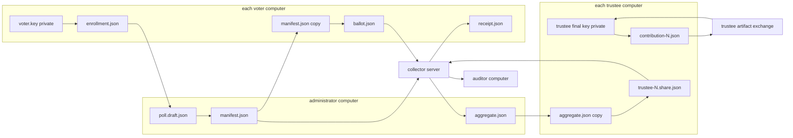
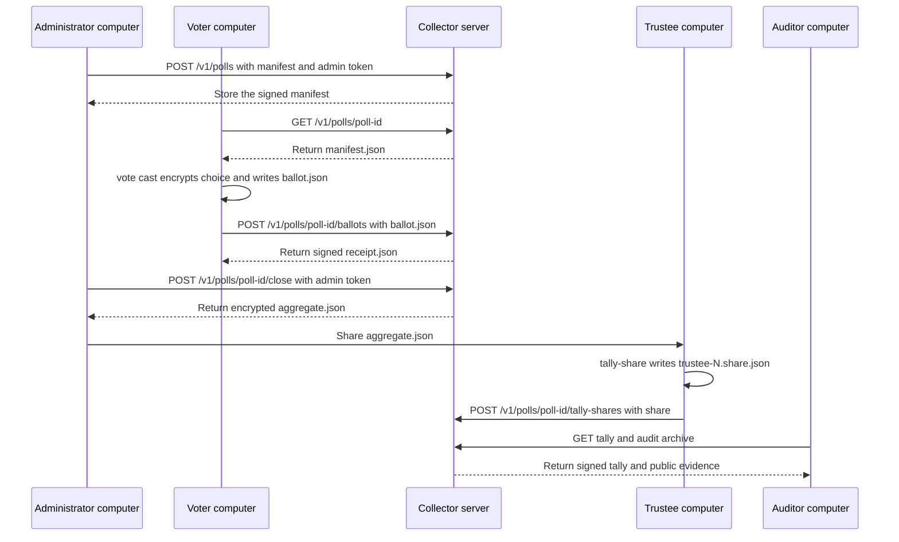
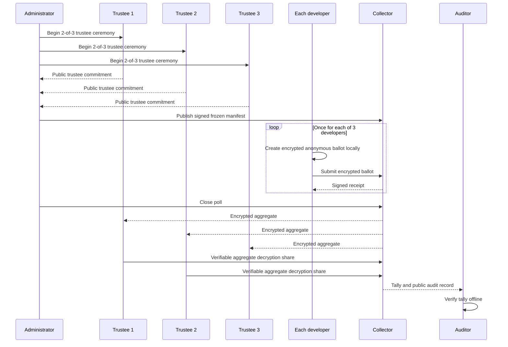

# Three Developer Anonymous Poll

Run an educational local poll in which three people choose a lunch option. The
public result shows only totals. It does not include a voter-to-choice mapping.

Vota is experimental educational software. Do not use this example for a real
election, a workplace decision with consequences, or a secret ballot that
requires strong anonymity.

## Start Here

From the repository root:

```sh
./examples/three-dev-anonymous-poll/three-dev-anonymous-poll.sh
```

The script needs Go, Bash, `curl`, `jq`, and `shasum`. It builds Vota, starts a
collector on `127.0.0.1:18080`, asks each of three developers to enter one of
`pizza`, `ramen`, or `salad`, then prints only the final totals.

The choice prompt disables terminal echo. The script does not contain a
developer-to-choice mapping and does not print one. It deletes the temporary
keys, ballots, database, and audit record on exit.

For a slower inspection run:

```sh
KEEP_DEMO=1 ./examples/three-dev-anonymous-poll/three-dev-anonymous-poll.sh
```

The script prints the retained directory. Treat it as private: it contains the
demo identities, trustee shares, administrator key, and collector database.

Set `VOTA_PORT` when port 18080 is busy. Set `VOTA_BIN` to reuse a prebuilt
binary. `VOTA_DEMO_PASSPHRASE` and `VOTA_DEMO_ADMIN_TOKEN` only change
demo-only secrets.

## When Each Role Uses a Separate Computer

The script puts every role on one computer so it can demonstrate the full
workflow. That is not how a distributed poll should run. In a real deployment,
the administrator, each voter, each trustee, and the collector use separate
machines and keep their own private files and passphrases.

The important rule is: a command either creates a local file, exchanges a file
with another role, or sends a file to the collector over HTTPS. It never sends a
private key or a plaintext choice to the collector.

### What Moves Between Computers

| Artifact                                  | Created by                          | Goes to                                              | Never goes to                                     |
| ----------------------------------------- | ----------------------------------- | ---------------------------------------------------- | ------------------------------------------------- |
| `voter.key`                               | voter                               | stays on that voter computer                         | administrator, collector, trustees                |
| `enrollment.json`                         | voter                               | administrator before freeze                          | other voters' private storage                     |
| `trustee-N.key` and `trustee-N.final.key` | trustee N                           | stay on trustee N's computer                         | administrator, collector, voters                  |
| `trustee-N.public.json`                   | trustee N                           | ceremony coordinator and other trustees              | no secrecy requirement                            |
| `contribution-N.json`                     | trustee N                           | every trustee through a controlled artifact exchange | the public collector API                          |
| `manifest.json`                           | administrator                       | collector, every voter, trustees, auditors           | no secrecy requirement                            |
| `ballot.json`                             | voter                               | collector, through `vote submit`                     | administrator and trustees as a hand-carried file |
| `receipt.json`                            | collector response                  | the submitting voter                                 | no secrecy requirement                            |
| `aggregate.json`                          | collector response to administrator | every trustee after close                            | no secrecy requirement                            |
| `trustee-N.share.json`                    | trustee N                           | collector, through `tally submit-share`              | other trustee private storage                     |
| audit archive                             | collector                           | anyone checking the poll                             | no secrecy requirement                            |

`contribution-N.json` contains a signed public commitment and encrypted
per-recipient shares. Share it only with the trustees who need it to finalize
their own keys. Each trustee decrypts only the share addressed to them.



The arrows show artifact flow, not trust. For example, the collector stores a
ballot but cannot read its selected choice. The administrator receives an
enrollment proof but cannot use it to cast a ballot as that voter.

### Requests Made by `vota`

Most commands run entirely on the local computer. The commands below are the
ones that contact the collector. They use canonical JSON over HTTPS. `publish`
and `close` send the administrator token in an `Authorization: Bearer` header.

| CLI command           | Local input or work                                   | Collector request                       | Response                        |
| --------------------- | ----------------------------------------------------- | --------------------------------------- | ------------------------------- |
| `poll publish`        | reads `manifest.json`                                 | `POST /v1/polls`                        | stored manifest                 |
| `poll get`            | writes a local manifest copy                          | `GET /v1/polls/<poll-id>`               | manifest and poll status        |
| `vote cast`           | reads manifest and voter key; encrypts choice locally | none                                    | writes `ballot.json`            |
| `vote submit`         | reads `ballot.json`                                   | `POST /v1/polls/<poll-id>/ballots`      | signed receipt                  |
| `poll close`          | sends administrator token                             | `POST /v1/polls/<poll-id>/close`        | encrypted aggregate             |
| `trustee tally-share` | reads manifest, aggregate, and trustee final key      | none                                    | writes trustee share            |
| `tally submit-share`  | reads trustee share                                   | `POST /v1/polls/<poll-id>/tally-shares` | tally when quorum is reached    |
| `tally get`           | none                                                  | `GET /v1/polls/<poll-id>/tally`         | signed tally                    |
| `audit export`        | none                                                  | `GET /v1/polls/<poll-id>/audit`         | compressed public audit archive |



The collector accepts a ballot or trustee share only after verifying its public
proofs. Voters and trustees need no collector account because the cryptographic
artifact, not a login, authorizes those operations.

### A Practical Three-Computer Setup

For a small educational test, use at least five machines or accounts: one
administrator, three trustees, and one voter machine per voter. A shared
artifact store can carry public files and trustee contributions. Use a separate
secure channel for each private key, passphrase, and trustee contribution.

1. Trustees exchange public descriptors and contribution files, then each runs
   `trustee ceremony finalize` using the complete contribution set.
1. The administrator creates a draft and gives its draft ID or file to each
   voter. Each voter returns only `enrollment.json`.
1. The administrator freezes the manifest, publishes it, and voters download
   the exact manifest with `poll get` before casting locally.
1. Each voter submits their own ballot directly to the collector. They do not
   send `ballot.json` through the administrator.
1. The administrator closes the poll and gives the returned aggregate to every
   trustee. Any quorum of trustees submit their own aggregate-only shares.
1. Anyone downloads the tally and audit archive and runs `audit verify` on
   their own machine.

The current collector does not provide anonymous transport. Separate computers
improve key separation, but not network anonymity: the collector can still see
the submitter's IP address and timing. Use an appropriate anonymity-preserving
transport if those metadata matter.

## What You Saw

At the human level, this is a sealed ballot box:

1. Three people are placed on the eligible-voter list before voting starts.
   Each voter creates and keeps a private, poll-local identity. They give the
   administrator only an enrollment proof. The administrator adds that proof
   to the draft.

   ```sh
   vota identity create --poll poll.draft.json --out alice.key
   vota identity enroll export --identity alice.key --out alice.enrollment.json
   vota poll eligible add \
     --draft poll.draft.json \
     --enrollment alice.enrollment.json
   ```

   Repeat this once for each voter. `alice.key` stays with Alice. The
   enrollment file is public and proves possession of the identity without
   exposing its private scalar.

1. The list is frozen, so it cannot change halfway through the poll. The
   administrator signs the final manifest, then publishes it to the collector.

   ```sh
   vota poll freeze --yes \
     --draft poll.draft.json \
     --admin-key admin.key \
     --out manifest.json
   vota poll publish --manifest manifest.json --server http://127.0.0.1:18080
   ```

   `manifest.json` is the shared public source of truth. Send every voter the
   same file and have them verify its poll question, choices, dates, and
   eligibility list before voting.

1. Each person submits one locked ballot. A voter runs these commands locally.
   `vote cast` prompts for the choice without placing it on the command line.

   ```sh
   vota vote cast \
     --poll manifest.json \
     --identity alice.key \
     --out alice.ballot.json
   vota vote submit \
     --ballot alice.ballot.json \
     --server http://127.0.0.1:18080 \
     --receipt alice.receipt.json
   ```

   The receipt proves the collector accepted a particular encrypted ballot. It
   does not disclose Alice's choice. Each voter keeps their own receipt.

1. The box counts the locked ballots without opening them one by one. Once the
   voting window ends, the administrator closes the poll. The collector
   publishes one encrypted aggregate, not a plaintext list of votes.

   ```sh
   poll_id="$(jq -r '.poll_id' manifest.json)"
   vota poll close \
     --poll "$poll_id" \
     --server http://127.0.0.1:18080 \
     --json > aggregate.json
   ```

   The tally remains unavailable unless the manifest privacy threshold is met.

1. Two of three trustees unlock the combined result. Each trustee independently
   creates and submits a share for `aggregate.json`. After the second valid
   share, anyone can fetch the tally and verify the public evidence offline.

   ```sh
   vota trustee tally-share \
     --poll manifest.json \
     --aggregate aggregate.json \
     --key trustee-1.final.key \
     --out trustee-1.share.json
   vota tally submit-share \
     --share trustee-1.share.json \
     --server http://127.0.0.1:18080

   vota tally get --poll "$poll_id" --server http://127.0.0.1:18080 --out tally.json
   vota audit export --poll "$poll_id" --server http://127.0.0.1:18080 --out audit
   vota audit verify --record audit
   ```

   A second trustee repeats the first two commands with their own finalized key
   and share file. No trustee needs a voter identity or a selected choice.

### How the Roles Interact



The printed tally might be `pizza: 2`, `ramen: 1`, `salad: 0`. No public file
says which eligible person supplied the pizza or ramen ballot.

The script uses `privacy_threshold: 3`. The collector releases a tally only
after three accepted ballots. This prevents the most obvious disclosure from a
one- or two-person poll. It cannot stop a unanimous or otherwise revealing
three-person result.

## How To Use The Pieces

The script has a complete small-poll lifecycle. For a real integration, replace
the local setup pieces with your systems while retaining the boundaries:

| Stage         | Command family                                                           | Purpose                                                                         |
| ------------- | ------------------------------------------------------------------------ | ------------------------------------------------------------------------------- |
| Trustee setup | `vota trustee key`, `vota trustee ceremony`                              | Three trustees create a shared 2-of-3 election key.                             |
| Poll setup    | `vota admin`, `vota poll create`                                         | An administrator defines the question, choices, trustees, dates, and threshold. |
| Enrollment    | `vota identity`, `vota poll eligible add`                                | Each voter proves control of a poll-local anonymous identity.                   |
| Freeze        | `vota poll freeze`                                                       | Signs an immutable manifest with the eligible ring.                             |
| Voting        | `vota vote cast`, `vota vote submit`                                     | A voter creates an encrypted ballot locally, then submits it.                   |
| Counting      | `vota poll close`, `vota trustee tally-share`, `vota tally submit-share` | Trustees decrypt only the aggregate after the poll closes.                      |
| Verification  | `vota audit export`, `vota audit verify`                                 | Anyone can reproduce and check the published result offline.                    |

The maintained automated version of this lifecycle is
[`test/e2e/workflow_test.go`](../../test/e2e/workflow_test.go). Run it with:

```sh
go test ./test/e2e -run TestAnonymousPollWorkflow -count=1 -v
```

## What "Anonymous" Means Here

The public ballot proves that one eligible identity authorized it, but does not
identify which one. It also carries a per-poll link tag. The collector can
reject a second ballot from the same identity without learning the identity.

This example is not anonymous against its operator. One machine creates the
identities and receives submissions in order. A collector can also observe IP
addresses, timing, and request metadata. A three-person tally can reveal a
choice from context. For the strongest demonstration, each developer must:

1. Keep their own identity key and passphrase.
1. Cast their ballot on their own device.
1. Submit through an anonymity-preserving transport.
1. Compare signed receipts and exported audit records with other voters.

The supported CLI prevents ordinary double voting, not a trustee quorum from
writing separate tooling to decrypt individual ciphertexts. Trustees must be
independent people with a policy against doing so.

## Under The Hood

The frozen manifest commits to the eligible Ristretto255 public keys, the
choice list, trustee public commitments, threshold values, dates, and the
administrator signature. The ballot contains:

1. An encrypted one-hot vector. Exactly one slot encrypts `1`; all other slots
   encrypt `0`.
1. A proof that this vector is well formed without revealing the selected slot.
1. A poll-local linkable ring signature. It proves that the signer owns one
   private scalar corresponding to one public key in the eligible ring, while
   hiding which ring member it is.
1. A link tag derived from that scalar and the poll context. Equal tags expose
   a repeat voter to the collector without revealing their eligible key.

The collector verifies each proof and homomorphically aggregates matching
ciphertext slots. It does not need a voter secret or a selected-choice value.
After closing, a 2-of-3 Feldman distributed key generation ceremony lets any
two trustees publish verifiable decryption shares for that aggregate. The
combined shares recover only the choice totals. `audit verify` replays the
manifest, ballots, receipts, aggregate, shares, tally, and checkpoint chain
without accessing the collector database.

Read [the security model](../../docs/security.md) before relying on any
property beyond this demonstration. Read [the experimental protocol](../../docs/protocol/vota-v1-experimental.md)
for serialization and verification details.
